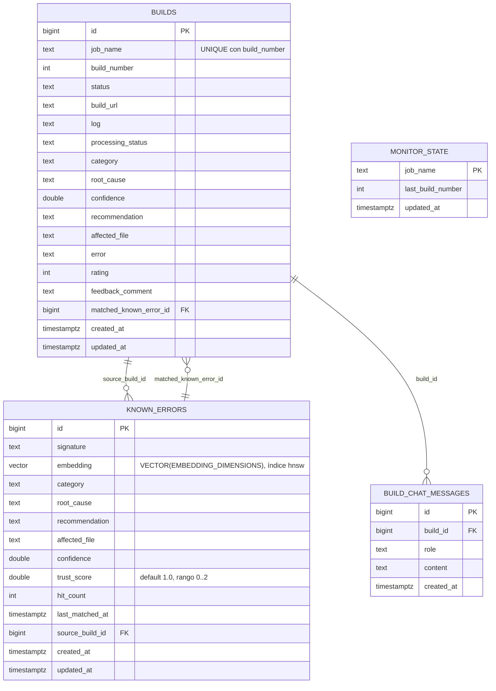

# Esquema de base de datos

Generado a partir de las migraciones de Alembic en `migrations/versions/`
(orden: `ab1386998fbf` → `934c32287d37` → `bdcb1487656c` → `0871849c2c2e` →
`b76b27eff5b5`).
PostgreSQL + extensión `vector` (pgvector).

## Notas

- `monitor_state` no tiene claves foráneas; se relaciona con `builds` solo por
  `job_name` a nivel de aplicación (estado del poller de Jenkins en
  `JenkinsMonitor`).
- `known_errors.source_build_id` → `builds.id` (`ON DELETE SET NULL`): la
  build que originó el diagnóstico indexado.
- `builds.matched_known_error_id` → `known_errors.id` (`ON DELETE SET NULL`):
  qué entrada RAG resolvió la build, usada para ajustar `trust_score` con el
  feedback del usuario.
- `build_chat_messages.build_id` → `builds.id` (`ON DELETE CASCADE`): historial
  de chat por build.
- `builds.affected_file` y `known_errors.affected_file` son opcionales
  (`NULL` si el LLM no lo identifica); los diagnósticos previos a la
  migración `b76b27eff5b5` siempre lo tienen `NULL`.
- La dimensión de `known_errors.embedding` se fija en tiempo de migración
  desde `EMBEDDING_DIMENSIONS` (por defecto 768); cambiarla requiere una
  nueva migración que recree la columna/índice.
